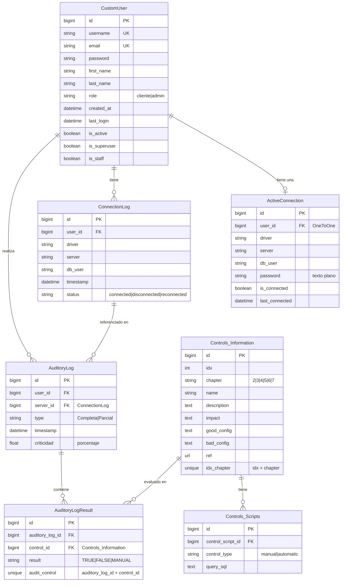
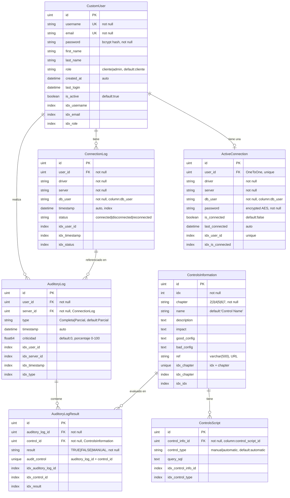

# Esquema de Base de Datos

Este documento describe el modelo de base de datos tanto del sistema actual (Django/Python) como el propuesto para la migración (Golang con Arquitectura Hexagonal).

---

## Modelo de Base de Datos Actual (Django/Python)

### Diagrama ER (Entity Relationship)



### Descripción de Tablas

#### `CustomUser` (Users_App)
Usuario del sistema con autenticación.

**Campos clave:**
- `id`: Identificador único
- `username`: Nombre de usuario único
- `email`: Email único
- `password`: Contraseña hasheada (bcrypt)
- `role`: Rol del usuario (`cliente` o `admin`)
- `created_at`: Fecha de creación
- `last_login`: Último inicio de sesión
- `is_active`: Estado activo/inactivo

#### `ActiveConnection` (Connecting_App)
Conexión activa de un usuario a un servidor SQL Server.

**Relaciones:**
- OneToOne con `CustomUser` (un usuario solo puede tener una conexión activa)

**Campos clave:**
- `user_id`: Referencia al usuario (clave única)
- `driver`: Driver ODBC (ej: "ODBC Driver 17 for SQL Server")
- `server`: IP o nombre del servidor SQL Server
- `db_user`: Usuario de SQL Server
- `password`: **⚠️ Contraseña en texto plano** (debe encriptarse)
- `is_connected`: Estado de conexión

#### `ConnectionLog` (Logs_App)
Historial de conexiones y desconexiones de usuarios.

**Relaciones:**
- ManyToOne con `CustomUser`

**Campos clave:**
- `user_id`: Referencia al usuario
- `timestamp`: Fecha y hora del evento
- `status`: Estado (`connected`, `disconnected`, `reconnected`)

#### `Controls_Information` (InsideDB_App)
Catálogo de controles de auditoría disponibles.

**Campos clave:**
- `idx`: Índice del control
- `chapter`: Capítulo (2, 3, 4, 5, 6, 7)
- `name`: Nombre del control
- `description`: Descripción detallada
- `impact`: Impacto de no cumplir el control
- `good_config`: Mensaje cuando está bien configurado
- `bad_config`: Mensaje cuando está mal configurado
- `ref`: URL de referencia/documentación

**Restricciones:**
- `idx` + `chapter` forman una clave única compuesta

#### `Controls_Scripts` (InsideDB_App)
Scripts SQL asociados a cada control de auditoría.

**Relaciones:**
- ManyToOne con `Controls_Information`

**Campos clave:**
- `control_script_id`: Referencia al control
- `control_type`: Tipo de control (`manual` o `automatic`)
- `query_sql`: Query SQL a ejecutar (solo para controles automáticos)

#### `AuditoryLog` (Logs_App)
Registro de auditorías ejecutadas por usuarios.

**Relaciones:**
- ManyToOne con `CustomUser`
- ManyToOne con `ConnectionLog` (referencia al servidor)

**Campos clave:**
- `user_id`: Usuario que ejecutó la auditoría
- `server_id`: Referencia al `ConnectionLog` del servidor
- `type`: Tipo de auditoría (`Completa` o `Parcial`)
- `timestamp`: Fecha y hora de ejecución
- `criticidad`: Porcentaje de controles fallidos (0-100)

#### `AuditoryLogResult` (Logs_App)
Resultados individuales de cada control en una auditoría.

**Relaciones:**
- ManyToOne con `AuditoryLog`
- ManyToOne con `Controls_Information`

**Campos clave:**
- `auditory_log_id`: Referencia a la auditoría
- `control_id`: Referencia al control evaluado
- `result`: Resultado (`TRUE`, `FALSE`, o `MANUAL`)

**Restricciones:**
- Un control no puede aparecer dos veces en la misma auditoría (clave única compuesta)

---

## Modelo de Base de Datos Propuesto (Golang/Arquitectura Hexagonal)

### Diagrama ER (Entity Relationship)



### Cambios y Mejoras Propuestas

#### 1. Nomenclatura
- **Django**: Nombres con guiones bajos y mayúsculas (ej: `Controls_Information`)
- **Golang**: Nombres en PascalCase (ej: `ControlsInformation`)
- **Columnas**: Se mantienen nombres descriptivos, algunos con tags GORM para mapeo

#### 2. Tipos de Datos
- **IDs**: `bigint` → `uint` (suficiente para la mayoría de casos)
- **Timestamps**: Se mantienen como `datetime`/`time.Time`
- **Booleanos**: Se mantienen como `boolean`/`bool`
- **Texto**: `text` → `text` (sin cambios)
- **Strings**: Se especifican tamaños máximos donde aplica

#### 3. Índices Adicionales
Se agregan índices para mejorar el rendimiento en consultas frecuentes:

- **CustomUser**: `idx_username`, `idx_email`, `idx_role`
- **ActiveConnection**: `idx_user_id` (único), `idx_is_connected`
- **ConnectionLog**: `idx_user_id`, `idx_timestamp`, `idx_status`
- **ControlsInformation**: `idx_chapter`, `idx_idx`
- **ControlsScript**: `idx_control_info_id`, `idx_control_type`
- **AuditoryLog**: `idx_user_id`, `idx_server_id`, `idx_timestamp`, `idx_type`
- **AuditoryLogResult**: `idx_auditory_log_id`, `idx_control_id`, `idx_result`

#### 4. Seguridad Mejorada
- **ActiveConnection.password**: 
  - ❌ Actual: Texto plano
  - ✅ Propuesto: Encriptado con AES-256
  - Se agrega campo adicional para almacenar IV (Initialization Vector) si es necesario

#### 5. Constraints y Validaciones
- Todos los campos marcados como `not null` en el modelo Go
- Valores por defecto explícitos
- Validaciones a nivel de aplicación (GORM tags)
- Constraints de unicidad mantenidos

#### 6. Optimizaciones
- Índices compuestos para búsquedas frecuentes
- Índices en foreign keys para mejor rendimiento en JOINs
- Consideración de particionado para tablas grandes (ConnectionLog, AuditoryLog)

---

## Modelo de Entidades Go (GORM)

### CustomUser

```go
type CustomUser struct {
    ID        uint      `gorm:"primaryKey" json:"id"`
    Username  string    `gorm:"unique;not null;index" json:"username"`
    Email     string    `gorm:"unique;not null;index" json:"email"`
    Password  string    `gorm:"not null" json:"-"` // No se serializa
    FirstName string    `json:"first_name"`
    LastName  string    `json:"last_name"`
    Role      string    `gorm:"default:cliente;index" json:"role"` // cliente, admin
    CreatedAt time.Time `json:"created_at"`
    LastLogin time.Time `json:"last_login"`
    IsActive  bool      `gorm:"default:true" json:"is_active"`
}
```

### ActiveConnection

```go
type ActiveConnection struct {
    ID           uint      `gorm:"primaryKey" json:"id"`
    UserID       uint      `gorm:"uniqueIndex;not null" json:"user_id"`
    User         CustomUser `gorm:"foreignKey:UserID;constraint:OnDelete:CASCADE" json:"-"`
    Driver       string    `gorm:"not null" json:"driver"`
    Server       string    `gorm:"not null" json:"server"`
    DBUser       string    `gorm:"column:db_user;not null" json:"db_user"`
    Password     string    `gorm:"not null" json:"-"` // Encriptado con AES
    IsConnected  bool      `gorm:"default:false;index" json:"is_connected"`
    LastConnected time.Time `json:"last_connected"`
}
```

### ConnectionLog

```go
type ConnectionLog struct {
    ID        uint      `gorm:"primaryKey" json:"id"`
    UserID    uint      `gorm:"not null;index" json:"user_id"`
    User      CustomUser `gorm:"foreignKey:UserID;constraint:OnDelete:CASCADE" json:"-"`
    Driver    string    `gorm:"not null" json:"driver"`
    Server    string    `gorm:"not null" json:"server"`
    DBUser    string    `gorm:"column:db_user;not null" json:"db_user"`
    Timestamp time.Time `gorm:"autoCreateTime;index" json:"timestamp"`
    Status    string    `gorm:"not null;index" json:"status"` // connected, disconnected, reconnected
}
```

### ControlsInformation

```go
type ControlsInformation struct {
    ID         uint   `gorm:"primaryKey" json:"id"`
    Idx        int    `gorm:"not null;uniqueIndex:idx_chapter;index" json:"idx"`
    Chapter    string `gorm:"not null;uniqueIndex:idx_chapter;index" json:"chapter"` // 2, 3, 4, 5, 6, 7
    Name       string `gorm:"default:'Control Name'" json:"name"`
    Description string `gorm:"type:text" json:"description"`
    Impact     string `gorm:"type:text" json:"impact"`
    GoodConfig string `gorm:"type:text" json:"good_config"`
    BadConfig  string `gorm:"type:text" json:"bad_config"`
    Ref        string `gorm:"type:varchar(500)" json:"ref"`
}
```

### ControlsScript

```go
type ControlsScript struct {
    ID             uint              `gorm:"primaryKey" json:"id"`
    ControlInfoID  uint              `gorm:"column:control_script_id;not null;index" json:"control_script_id"`
    ControlInfo    ControlsInformation `gorm:"foreignKey:ControlInfoID;constraint:OnDelete:CASCADE" json:"-"`
    ControlType    string            `gorm:"default:automatic;index" json:"control_type"` // manual, automatic
    QuerySQL       string            `gorm:"type:text" json:"query_sql"`
}
```

### AuditoryLog

```go
type AuditoryLog struct {
    ID         uint      `gorm:"primaryKey" json:"id"`
    UserID     uint      `gorm:"not null;index" json:"user_id"`
    User       CustomUser `gorm:"foreignKey:UserID;constraint:OnDelete:CASCADE" json:"-"`
    ServerID   uint      `gorm:"not null;index" json:"server_id"`
    Server     ConnectionLog `gorm:"foreignKey:ServerID;constraint:OnDelete:CASCADE" json:"-"`
    Type       string    `gorm:"default:parcial;index" json:"type"` // Completa, Parcial
    Timestamp  time.Time `gorm:"autoCreateTime;index" json:"timestamp"`
    Criticidad float64   `gorm:"default:0" json:"criticidad"` // 0-100
    Results    []AuditoryLogResult `gorm:"foreignKey:AuditoryLogID;constraint:OnDelete:CASCADE" json:"results,omitempty"`
}
```

### AuditoryLogResult

```go
type AuditoryLogResult struct {
    ID            uint              `gorm:"primaryKey" json:"id"`
    AuditoryLogID uint              `gorm:"not null;uniqueIndex:audit_control;index" json:"auditory_log_id"`
    AuditoryLog   AuditoryLog       `gorm:"foreignKey:AuditoryLogID;constraint:OnDelete:CASCADE" json:"-"`
    ControlID     uint              `gorm:"not null;uniqueIndex:audit_control;index" json:"control_id"`
    Control       ControlsInformation `gorm:"foreignKey:ControlID;constraint:OnDelete:CASCADE" json:"-"`
    Result        string            `gorm:"not null;index" json:"result"` // TRUE, FALSE, MANUAL
}
```

---

## Migraciones de Base de Datos

### Ejemplo de Migración GORM

```go
package migrations

import (
    "gorm.io/gorm"
    "your-project/internal/domain/entities"
)

func Migrate(db *gorm.DB) error {
    return db.AutoMigrate(
        &entities.CustomUser{},
        &entities.ActiveConnection{},
        &entities.ConnectionLog{},
        &entities.ControlsInformation{},
        &entities.ControlsScript{},
        &entities.AuditoryLog{},
        &entities.AuditoryLogResult{},
    )
}
```

### SQL de Migración Manual (Alternativa)

Si prefieres migraciones SQL manuales:

```sql
-- Tabla: custom_users
CREATE TABLE custom_users (
    id INTEGER PRIMARY KEY AUTOINCREMENT,
    username VARCHAR(150) UNIQUE NOT NULL,
    email VARCHAR(254) UNIQUE NOT NULL,
    password VARCHAR(128) NOT NULL,
    first_name VARCHAR(150),
    last_name VARCHAR(150),
    role VARCHAR(10) DEFAULT 'cliente',
    created_at DATETIME NOT NULL,
    last_login DATETIME,
    is_active BOOLEAN DEFAULT 1,
    CONSTRAINT chk_role CHECK (role IN ('cliente', 'admin'))
);

CREATE INDEX idx_username ON custom_users(username);
CREATE INDEX idx_email ON custom_users(email);
CREATE INDEX idx_role ON custom_users(role);

-- Tabla: active_connections
CREATE TABLE active_connections (
    id INTEGER PRIMARY KEY AUTOINCREMENT,
    user_id INTEGER UNIQUE NOT NULL,
    driver VARCHAR(255) NOT NULL,
    server VARCHAR(255) NOT NULL,
    db_user VARCHAR(255) NOT NULL,
    password VARCHAR(500) NOT NULL, -- Encriptado
    is_connected BOOLEAN DEFAULT 0,
    last_connected DATETIME NOT NULL,
    FOREIGN KEY (user_id) REFERENCES custom_users(id) ON DELETE CASCADE
);

CREATE UNIQUE INDEX idx_user_id ON active_connections(user_id);
CREATE INDEX idx_is_connected ON active_connections(is_connected);

-- Tabla: connection_logs
CREATE TABLE connection_logs (
    id INTEGER PRIMARY KEY AUTOINCREMENT,
    user_id INTEGER NOT NULL,
    driver VARCHAR(255) NOT NULL,
    server VARCHAR(255) NOT NULL,
    db_user VARCHAR(255) NOT NULL,
    timestamp DATETIME NOT NULL,
    status VARCHAR(50) NOT NULL,
    FOREIGN KEY (user_id) REFERENCES custom_users(id) ON DELETE CASCADE,
    CONSTRAINT chk_status CHECK (status IN ('connected', 'disconnected', 'reconnected'))
);

CREATE INDEX idx_user_id ON connection_logs(user_id);
CREATE INDEX idx_timestamp ON connection_logs(timestamp);
CREATE INDEX idx_status ON connection_logs(status);

-- Tabla: controls_information
CREATE TABLE controls_information (
    id INTEGER PRIMARY KEY AUTOINCREMENT,
    idx INTEGER NOT NULL,
    chapter VARCHAR(10) NOT NULL,
    name VARCHAR(255) DEFAULT 'Control Name',
    description TEXT,
    impact TEXT,
    good_config TEXT,
    bad_config TEXT,
    ref VARCHAR(500),
    UNIQUE(idx, chapter),
    CONSTRAINT chk_chapter CHECK (chapter IN ('2', '3', '4', '5', '6', '7'))
);

CREATE UNIQUE INDEX idx_chapter ON controls_information(idx, chapter);
CREATE INDEX idx_chapter_only ON controls_information(chapter);
CREATE INDEX idx_idx ON controls_information(idx);

-- Tabla: controls_scripts
CREATE TABLE controls_scripts (
    id INTEGER PRIMARY KEY AUTOINCREMENT,
    control_script_id INTEGER NOT NULL,
    control_type VARCHAR(10) DEFAULT 'automatic',
    query_sql TEXT,
    FOREIGN KEY (control_script_id) REFERENCES controls_information(id) ON DELETE CASCADE,
    CONSTRAINT chk_control_type CHECK (control_type IN ('manual', 'automatic'))
);

CREATE INDEX idx_control_info_id ON controls_scripts(control_script_id);
CREATE INDEX idx_control_type ON controls_scripts(control_type);

-- Tabla: auditory_logs
CREATE TABLE auditory_logs (
    id INTEGER PRIMARY KEY AUTOINCREMENT,
    user_id INTEGER NOT NULL,
    server_id INTEGER NOT NULL,
    type VARCHAR(50) DEFAULT 'Parcial',
    timestamp DATETIME NOT NULL,
    criticidad REAL DEFAULT 0,
    FOREIGN KEY (user_id) REFERENCES custom_users(id) ON DELETE CASCADE,
    FOREIGN KEY (server_id) REFERENCES connection_logs(id) ON DELETE CASCADE,
    CONSTRAINT chk_type CHECK (type IN ('Completa', 'Parcial')),
    CONSTRAINT chk_criticidad CHECK (criticidad >= 0 AND criticidad <= 100)
);

CREATE INDEX idx_user_id ON auditory_logs(user_id);
CREATE INDEX idx_server_id ON auditory_logs(server_id);
CREATE INDEX idx_timestamp ON auditory_logs(timestamp);
CREATE INDEX idx_type ON auditory_logs(type);

-- Tabla: auditory_log_results
CREATE TABLE auditory_log_results (
    id INTEGER PRIMARY KEY AUTOINCREMENT,
    auditory_log_id INTEGER NOT NULL,
    control_id INTEGER NOT NULL,
    result VARCHAR(10) NOT NULL,
    FOREIGN KEY (auditory_log_id) REFERENCES auditory_logs(id) ON DELETE CASCADE,
    FOREIGN KEY (control_id) REFERENCES controls_information(id) ON DELETE CASCADE,
    UNIQUE(auditory_log_id, control_id),
    CONSTRAINT chk_result CHECK (result IN ('TRUE', 'FALSE', 'MANUAL'))
);

CREATE UNIQUE INDEX idx_audit_control ON auditory_log_results(auditory_log_id, control_id);
CREATE INDEX idx_auditory_log_id ON auditory_log_results(auditory_log_id);
CREATE INDEX idx_control_id ON auditory_log_results(control_id);
CREATE INDEX idx_result ON auditory_log_results(result);
```

---

## Comparación de Esquemas

| Aspecto | Django (Actual) | Golang (Propuesto) |
|---------|----------------|-------------------|
| **Nomenclatura** | Snake_case con guiones bajos | PascalCase |
| **IDs** | `bigint` | `uint` |
| **Encriptación** | ❌ Contraseñas en texto plano | ✅ AES-256 |
| **Índices** | Básicos (PK, FK, unique) | Optimizados (múltiples índices) |
| **Constraints** | A nivel de aplicación | A nivel de DB y aplicación |
| **Cascadas** | Django ORM maneja | GORM + SQL constraints |
| **Migraciones** | Django migrations | GORM AutoMigrate o SQL manual |
| **Validaciones** | Django validators | GORM tags + validators Go |

---

## Notas de Migración

### 1. Migración de Datos Existentes

Si existe una base de datos Django con datos:

1. **Exportar datos**: Usar `python manage.py dumpdata` para exportar datos
2. **Transformar formato**: Convertir JSON de Django al formato Go
3. **Encriptar contraseñas**: Encriptar todas las contraseñas de `ActiveConnection`
4. **Importar datos**: Script de migración para importar a nueva base de datos

### 2. Consideraciones de Rendimiento

- Los índices adicionales mejoran las consultas pero aumentan el tiempo de escritura
- Considerar particionado para `ConnectionLog` si crece mucho
- Implementar archiving para logs antiguos

### 3. Backup y Recuperación

- Implementar estrategia de backup regular
- Considerar SQLite backups incrementales
- Documentar procedimiento de recuperación

---

**Última actualización**: Enero 2025

