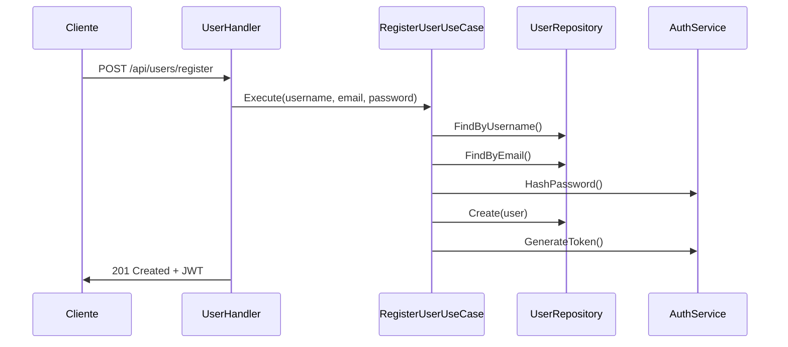

# Arquitectura del Backend Go

## Descripción General

El backend está construido siguiendo los principios de **Arquitectura Hexagonal** (también conocida como Ports & Adapters), lo que nos permite:

- Aislar la lógica de negocio de los detalles de implementación
- Facilitar el testing mediante inversión de dependencias
- Permitir cambios de tecnología sin afectar el dominio
- Mantener el código organizado y con responsabilidades claras

## Estructura del Proyecto

```
backend-go/
├── cmd/                    # Puntos de entrada
│   └── server/            # Servidor HTTP
├── internal/              # Código privado de la aplicación
│   ├── domain/           # Núcleo de la aplicación
│   ├── adapters/         # Implementaciones de puertos
│   └── config/           # Configuración
├── pkg/                   # Código público reutilizable
├── docs/                  # Documentación
└── tests/                # Tests E2E
```

## Capas de la Arquitectura

### 1. Dominio (`internal/domain/`)

El corazón de la aplicación, contiene:

- **Entidades**: Modelos de negocio puros
  - `User`, `ActiveConnection`, `ControlsInformation`, etc.
  - No tienen dependencias externas
  - Definen el estado y comportamiento del dominio

- **Puertos**: Interfaces que definen contratos
  - `repositories/`: Para persistencia
  - `services/`: Para servicios externos (auth, encryption)
  - Permiten inversión de dependencias

- **Casos de Uso**: Lógica de aplicación
  - Un caso de uso por archivo
  - Implementan operaciones de negocio
  - Dependen solo de interfaces (puertos)

### 2. Adaptadores (`internal/adapters/`)

#### Primarios (Entrada)
- **HTTP**: Implementación web usando Gin
  - `handlers/`: Controladores HTTP
  - `middleware/`: Auth, logging, etc.
  - `dto/`: Data Transfer Objects
  - `routes.go`: Registro de rutas

#### Secundarios (Salida)
- **Persistence**: Implementación con SQL Server
  - Repositorios usando GORM
  - Migraciones de base de datos
- **Security**: JWT y encriptación
  - Implementación de AuthService
  - Manejo de tokens JWT
  - Hashing de contraseñas

## Flujo de Datos

1. Request HTTP → Gin Router
2. Router → Middleware (auth, logging)
3. Middleware → Handler
4. Handler → Caso de Uso
5. Caso de Uso ↔ Repositorio/Servicio
6. Handler ← Respuesta
7. Response HTTP

## Ejemplo: Registro de Usuario



## Testing

### 1. Tests Unitarios
- Mock de repositorios y servicios
- Pruebas de casos de uso aisladas
- Validación de lógica de negocio

### 2. Tests de Integración
- Pruebas con base de datos de test
- Validación de queries y transacciones
- Pruebas de adaptadores completos

### 3. Tests E2E
- Pruebas de API completas
- Validación de flujos completos
- Cobertura de casos de uso reales

## Agregar Nuevas Funcionalidades

1. Definir entidad en `domain/entities/`
2. Crear puerto en `domain/ports/`
3. Implementar caso de uso en `domain/usecases/`
4. Agregar adaptadores necesarios
5. Registrar rutas en `http/routes.go`
6. Documentar en Swagger
7. Agregar tests

## Configuración y Variables de Entorno

Ver `.env.example` para la lista completa de variables soportadas:

```env
# Server
SERVER_PORT=8000
SERVER_HOST=localhost

# Database
MSSQL_HOST=localhost
MSSQL_PORT=1433
MSSQL_USER=sa
MSSQL_PASSWORD=yourStrong(!)Password
MSSQL_DATABASE=microsql

# JWT
JWT_SECRET=your-secret-key
JWT_EXPIRATION_HOURS=24

# Logging
LOG_LEVEL=info
LOG_FORMAT=json
```

## API REST

La documentación completa de la API está disponible en Swagger:

```
http://localhost:8000/swagger/index.html
```

### Endpoints Principales

#### Usuarios
- `POST /api/users/register`: Registro
- `POST /api/users/login`: Login
- `GET /api/users/profile`: Perfil

#### SQL Server
- `POST /api/sql_conn/connect`: Conectar
- `POST /api/sql_conn/disconnect`: Desconectar

#### Auditoría
- `GET /api/controls/`: Listar controles
- `GET /api/controls/execute`: Ejecutar auditoría